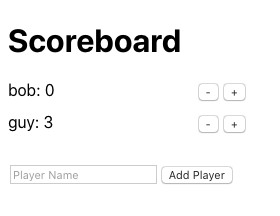

# Scoreboard

A simple scoreboard app built using React.

## Pre-requisites

To run the application, you will need:

-   Node.js version 12 or higher
-   NPM version 6 or higher

Additionally, in order to run functional tests with Cypress, you will need either Chrome or Firefox installed.
You may instead use Docker to run Cypress in "headless mode" (see below under `npm run cy:docker`).

See more details about system requirements for Cypress here:
[https://docs.cypress.io/guides/getting-started/installing-cypress.html#System-requirements](https://docs.cypress.io/guides/getting-started/installing-cypress.html#System-requirements)

## Installation

Install all NPM dependencies by running:

`npm install`

Install NPM dependencies excluding develepment-only dependencies by running:

`npm install --prod`

## Available Scripts

In the project directory, you can run:

### `npm start`

Runs the app in the development mode. 
Open [http://localhost:3000](http://localhost:3000) to view it in the browser.

The page will reload if you make edits. 
You will also see any lint errors in the console.

### `npm test`

Launches the test runner in the interactive watch mode. 
See the section about [running tests](https://facebook.github.io/create-react-app/docs/running-tests) for more information.

### `npm run build`

Builds the app for production to the `build` folder. 
It correctly bundles React in production mode and optimizes the build for the best performance.

The build is minified and the filenames include the hashes. 
Your app is ready to be deployed!

See the section about [deployment](https://facebook.github.io/create-react-app/docs/deployment) for more information.

### `npm run format`

Automatically formats all files using Prettier.
Learn more about Prettier at [prettier.io](https://prettier.io)

### `npm run cy:open`

Opens the Cypress GUI.
This allows you to select which browser Cypress should use, as well as select test files to run.

Requires Chrome or Firefox installation.
The development server must also be running (see `npm start`).

### `npm run cy:run`

Runs all Cypress tests in "headless mode" (doesn't open a browser window).

Requires Chrome or Firefox installation.
The development server must also be running (see `npm start`).

### `npm run cy:docker`

Runs all Cypress tests in "headless mode" withing a container using Docker.

Requires Docker installation.
The development server must also be running (see `npm start`).

### `npm run cy:podman`

Runs all Cypress tests in "headless mode" withing a container using podman.

Requires podman installation.
The development server must also be running (see `npm start`).
